# 🚀 End-to-End Azure Data Engineering Project

## 📋 Project Overview

This project demonstrates a complete **end-to-end data engineering pipeline** built on Microsoft Azure, processing Brazilian e-commerce data from Olist using modern cloud technologies. The solution follows the **Medallion Architecture** (Bronze-Silver-Gold) pattern and implements industry best practices for scalable data processing.

## 🏗️ Architecture Diagram

```mermaid
graph LR
    subgraph "Data Sources"
        A[📡 HTTP/GitHub] 
        B[🗄️ SQL Database]
        C[🍃 MongoDB]
    end
    
    subgraph "Ingestion Layer"
        D[🏭 Azure Data Factory]
    end
    
    subgraph "Storage Layer"
        E[💾 ADLS Gen2<br/>Bronze Layer]
    end
    
    subgraph "Processing Layer"
        F[🧱 Azure Databricks]
    end
    
    subgraph "Curated Layer"
        G[💎 ADLS Gen2<br/>Silver/Gold Layer]
    end
    
    subgraph "Analytics Layer"
        H[⚡ Azure Synapse]
    end
    
    subgraph "Visualization"
        I[📊 Power BI<br/>📈 Tableau<br/>🔷 Fabric]
    end
    
    A --> D
    B --> D
    C --> F
    D --> E
    E --> F
    F --> G
    G --> H
    H --> I
    
    style A fill:#e1f5fe
    style B fill:#e8f5e8
    style C fill:#fff3e0
    style D fill:#e3f2fd
    style E fill:#f1f8e9
    style F fill:#fff8e1
    style G fill:#e8f5e8
    style H fill:#f3e5f5
    style I fill:#fce4ec
```


## 🔧 Azure Data Factory Pipeline Architecture

### 📊 **Pipeline Flow Diagram**

```mermaid
graph TD
    A[🔍 Lookup Activity<br/>LookupForEachInput] --> B{📄 JSON Config<br/>Retrieved?}
    B -->|Success| C[🔄 ForEach Activity<br/>ForEach1]
    B -->|Failure| D[❌ Pipeline Fails]
    
    C --> E[📥 Copy Data Activity<br/>CopyInsideForEach]
    E --> F{🔄 More Items?}
    F -->|Yes| E
    F -->|No| G[📤 Copy SQL Data<br/>DataFromSQL]
    
    G --> H[✅ Pipeline Complete]
    
    subgraph "ForEach Loop Details"
        I[📋 Item 1: Customer Data]
        J[📋 Item 2: Orders Data]
        K[📋 Item 3: Products Data]
        L[📋 Item 4: ...]
        M[📋 Item N: Reviews Data]
    end
    
    style A fill:#e3f2fd
    style C fill:#fff3e0
    style E fill:#e8f5e8
    style G fill:#f3e5f5
```



### 🏗️ **Pipeline Components Breakdown**

#### 1️⃣ **Lookup Activity (`LookupForEachInput`)**
```json
{
  "name": "LookupForEachInput",
  "type": "Lookup",
  "description": "Retrieves JSON configuration for dynamic file processing",
  "source": {
    "type": "HTTP",
    "format": "JSON",
    "location": "GitHub repository configuration file"
  },
  "output": "Array of file configurations with metadata"
}
```

**Purpose**: 
- 🎯 **Dynamic Configuration**: Reads JSON file containing list of source files and their metadata
- 🔄 **Scalability**: Enables adding new data sources without pipeline modification
- 📋 **Centralized Control**: Single configuration file manages all data sources

**Configuration Example**:
```json
[
  {
	"csv_relative_url": "BigDataProjects/refs/heads/main/Project-Brazillian%20Ecommerce/Data/olist_customers_dataset.csv",
	"file_name":"olist_customers_dataset.csv"
	},
	{
	"csv_relative_url": "BigDataProjects/refs/heads/main/Project-Brazillian%20Ecommerce/Data/olist_geolocation_dataset.csv",
	"file_name":"olist_geolocation_dataset.csv"
	}
]
```

#### 2️⃣ **ForEach Activity (`ForEach1`)**
```yaml
ForEach Configuration:
  Sequential: true
  Batch Count: 1
  Input: "@activity('LookupForEachInput').output.value"
  
Activities Inside Loop:
  - Copy Data Activity (CopyInsideForEach)
```

**Key Features**:
- 🔄 **Sequential Processing**: Processes files one by one to avoid overwhelming storage
- 📊 **Parameterized Execution**: Each iteration receives different file parameters
- 🛡️ **Error Handling**: Individual file failures don't stop entire pipeline
- 📈 **Monitoring**: Detailed logs for each file processing activity

#### 3️⃣ **Copy Data Activity (`CopyInsideForEach`)**
```yaml
Source Configuration:
  Type: HTTP
  Format: Delimited Text (CSV)
  Base URL: "https://raw.githubusercontent.com/..."
  Relative URL: "@item().csv_relative_url"
  
Sink Configuration:
  Type: Azure Data Lake Storage Gen2
  Container: "olist-data"
  Folder: "bronze"
  File Name: "@item().file_name"
  Format: CSV
```

**Dynamic Parameters**:
- 🔗 **Source URL**: `@item().csv_relative_url` - Retrieved from ForEach item
- 📁 **Target File**: `@item().file_name` - Dynamic file naming
- 🏷️ **Metadata Preservation**: Original schema and structure maintained

#### 4️⃣ **SQL Copy Activity (`DataFromSQL`)**
```yaml
Source Configuration:
  Type: SQL Server
  Connection: "FilesIO MySQL Database"
  Table: "olist_order_payments"
  Query: "SELECT * FROM olist_order_payments"
  
Sink Configuration:
  Type: Azure Data Lake Storage Gen2
  Container: "olist-data" 
  Folder: "bronze"
  File Name: "order_payments.csv"
```

### ⚙️ **Parameterization Strategy**

#### 🎛️ **Pipeline Parameters**
| Parameter Name | Type | Purpose | Example Value |
|---|---|---|---|
| `storage_account` | String | Target storage account | `olistdatastorageaccount` |
| `container_name` | String | Target container | `olist-data` |
| `folder_path` | String | Target folder | `bronze` |
| `base_url` | String | Source base URL | `https://raw.githubusercontent.com/...` |

#### 🔄 **Dynamic Content Usage**
```javascript
// ForEach Item Access
@item().csv_relative_url    // Gets relative URL for current iteration
@item().file_name          // Gets target file name for current iteration

// Pipeline Functions
@activity('LookupForEachInput').output.value  // Lookup activity output
@pipeline().parameters.storage_account        // Pipeline parameter access
```


## 🛠️ Technologies & Services Used

### ☁️ **Azure Services**
-  **Azure Data Factory** - Data orchestration and ETL pipelines
-  **Azure Databricks** - Big data processing and analytics
-  **Azure Synapse Analytics** - Data warehousing and analytics
-  **Azure Data Lake Storage Gen2** - Scalable data storage

### 💻 **Programming & Query Languages**
-  **Python** - Data processing and transformation
-  **PySpark** - Distributed data processing
-  **SQL** - Data querying and analysis

### 🗄️ **Databases**
-  **MongoDB** - NoSQL database for enrichment data
-  **MySQL** - Relational database storage

### 📊 **Visualization Tools**
-  **Power BI** - Business intelligence and reporting
-  **Tableau** - Data visualization
-  **Microsoft Fabric** - Unified analytics platform

## 📊 Dataset Information

**Source**: Brazilian E-commerce Public Dataset by Olist (Kaggle)  
**Size**: 100K+ orders with comprehensive order, customer, product, and review information  
**Format**: Multiple CSV files with relational structure  
**Time Period**: 2016-2018 Brazilian e-commerce transactions  

### 📁 **Data Schema**
- 🛍️ **Orders**: Order details, status, timestamps
- 👥 **Customers**: Customer demographics and location
- 📦 **Products**: Product categories and attributes  
- 💳 **Payments**: Payment methods and installments
- ⭐ **Reviews**: Customer ratings and feedback
- 🚚 **Logistics**: Shipping and delivery information

## 🏗️ Implementation Details

### 1️⃣ **Data Ingestion (Bronze Layer)**
```yaml
Azure Data Factory Pipeline:
  - Source Connections:
    - HTTP endpoints (GitHub repositories)
    - SQL Server databases
    - File-based sources
  - Activities:
    - For Each loops for multiple files
    - Lookup activities for dynamic parameters
    - Copy activities with error handling
  - Output: Raw data in ADLS Gen2 Bronze container
```

### 2️⃣ **Data Transformation (Silver Layer)**
```python
# Azure Databricks Processing
- Data ingestion from Bronze layer using ABFSS protocol
- Data cleaning and deduplication
- Schema validation and type conversion
- Complex multi-table joins following star schema
- Business logic implementation:
  * Delivery time calculations
  * Delay analysis
  * Customer segmentation
- MongoDB integration for product enrichment
- Output: Curated Parquet files in Silver layer
```

### 3️⃣ **Data Serving (Gold Layer)**
```sql
-- Azure Synapse Analytics
-- Serverless SQL Pool implementation
CREATE EXTERNAL TABLE gold.final_sales_data
WITH (
    LOCATION = 'gold/final/',
    DATA_SOURCE = external_data_source,
    FILE_FORMAT = parquet_format
)
AS
SELECT * FROM silver.transformed_data
WHERE order_status = 'delivered';
```

## 🔄 **Medallion Architecture Implementation**

### 🥉 **Bronze Layer (Raw Data)**
- **Purpose**: Exact copy of source data
- **Format**: Original CSV format preserved
- **Transformations**: None (raw ingestion only)
- **Use Case**: Data lineage and reprocessing capability

### 🥈 **Silver Layer (Cleaned Data)**  
- **Purpose**: Business rules applied, cleaned and validated
- **Format**: Optimized Parquet format with Snappy compression
- **Transformations**: 
  - Data type conversions
  - Duplicate removal
  - Business logic calculations
  - Multi-table joins
- **Use Case**: Analytics-ready datasets

### 🥇 **Gold Layer (Curated Data)**
- **Purpose**: Aggregated, business-focused datasets
- **Format**: External tables via CETAS (Create External Table As Select)
- **Transformations**:
  - Aggregations and rollups
  - Business KPIs and metrics
  - Optimized for specific use cases
- **Use Case**: Direct consumption by BI tools and end users


## 📈 **Business Impact & Use Cases**

### 🎯 **Key Business Metrics Delivered**
- 📊 **Sales Performance**: Revenue trends and product performance analysis
- 🚚 **Logistics Optimization**: Delivery time analysis and improvement opportunities  
- 👥 **Customer Analytics**: Segmentation and behavior analysis
- 💳 **Payment Insights**: Payment method preferences and fraud detection
- ⭐ **Customer Satisfaction**: Review sentiment and rating analysis

### 🔍 **Analytics Capabilities**
- **Real-time Dashboards**: Live operational metrics
- **Historical Analysis**: Trend analysis and forecasting
- **Cohort Analysis**: Customer lifetime value and retention
- **Geographic Analysis**: Regional performance insights

## 🚀 **Getting Started**

### 📋 **Prerequisites**
```bash
# Required Azure Services
- Azure Subscription (Free tier sufficient for development)
- Azure Data Factory instance
- Azure Databricks workspace  
- Azure Synapse Analytics workspace
- Azure Data Lake Storage Gen2 account

# Development Tools
- Python 3.8+
- Azure CLI
- Git
```

## 🙏 **Acknowledgments**

- **Olist**: For providing the comprehensive e-commerce dataset
- **Microsoft Azure**: For the robust cloud infrastructure and services
- **Apache Spark**: For powerful distributed data processing capabilities
- **Open Source Community**: For the amazing tools and libraries used
- **Mayank Agarwal - Youtube Channel**: For amazing tutorials on big data end-to-end projects
